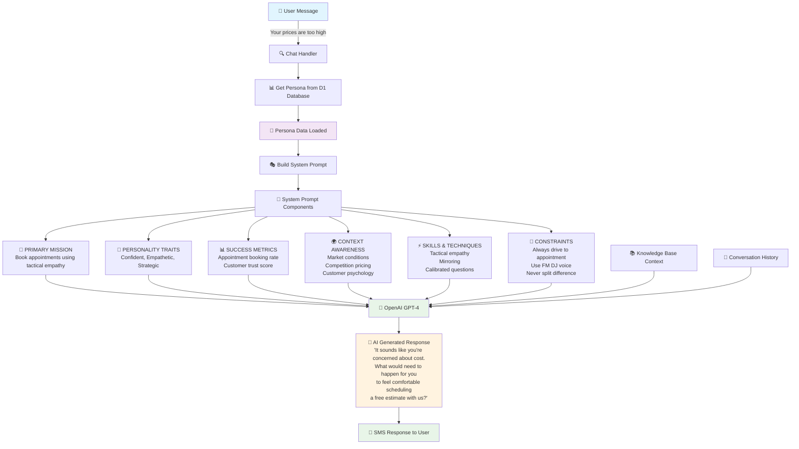

check# 🧠 AI Persona Integration System

## Overview

This document explains how our AI chat system integrates complete persona data from the database to generate authentic, goal-oriented responses. The system uses all persona fields including personality traits, success metrics, context awareness, skills, and constraints to create a comprehensive "personality blueprint" for the AI.

## 🎯 System Architecture Flow



## 🔄 Detailed Processing Flow

```
┌─────────────────────────────────────────────────────────────────────────────────┐
│                           🧠 PERSONA DATA INTEGRATION FLOW                      │
└─────────────────────────────────────────────────────────────────────────────────┘

┌─────────────────┐    ┌──────────────────────────────────────────────────────────┐
│   📱 User Input │────│ "Your prices are way too expensive compared to competitors" │
│   (SMS/Chat)    │    └──────────────────────────────────────────────────────────┘
└─────────────────┘                                 │
                                                    ▼
┌─────────────────────────────────────────────────────────────────────────────────┐
│                          🔍 CHAT HANDLER PROCESSING                             │
│  1. Parse message intent & context                                             │
│  2. Get persona from D1 database                                              │
│  3. Build comprehensive system prompt                                          │
└─────────────────────────────────────────────────────────────────────────────────┘
                                    │
                                    ▼
┌─────────────────────────────────────────────────────────────────────────────────┐
│                         🎭 PERSONA DATA FROM DATABASE                           │
│                                                                                 │
│  ┌─────────────────┐  ┌─────────────────┐  ┌─────────────────┐                │
│  │ 🎯 PRIMARY GOAL │  │ 🧠 PERSONALITY  │  │ 📊 SUCCESS      │                │
│  │ "Book appts     │  │ ["Confident",   │  │ ["Appointment   │                │
│  │  using tactical │  │  "Empathetic",  │  │  booking rate", │                │
│  │  empathy"       │  │  "Strategic"]   │  │  "Trust score"] │                │
│  └─────────────────┘  └─────────────────┘  └─────────────────┘                │
│                                                                                 │
│  ┌─────────────────┐  ┌─────────────────┐  ┌─────────────────┐                │
│  │ 🌍 CONTEXT      │  │ ⚡ SKILLS &     │  │ 🚫 CONSTRAINTS  │                │
│  │ ["Market conds",│  │ ["Tactical      │  │ ["Drive to appt",│                │
│  │  "Competition", │  │  empathy",      │  │  "FM DJ voice", │                │
│  │  "Customer psyc"]│  │  "Mirroring"]   │  │  "No splitting"]│                │
│  └─────────────────┘  └─────────────────┘  └─────────────────┘                │
└─────────────────────────────────────────────────────────────────────────────────┘
                                    │
                                    ▼
┌─────────────────────────────────────────────────────────────────────────────────┐
│                      📝 SYSTEM PROMPT CONSTRUCTION                              │
│                                                                                 │
│  ## 🎯 PRIMARY MISSION                                                         │
│  Book appointments using tactical empathy and calibrated questions             │
│                                                                                 │
│  ## 🧠 PERSONALITY TRAITS & COMMUNICATION STYLE                               │
│  Core Traits: Confident, Empathetic, Strategic                                │
│  Communication Style: Late-night FM DJ voice - deep, slow, reassuring         │
│                                                                                 │
│  ## 📊 SUCCESS METRICS & GOALS                                                │
│  - Appointment booking rate                                                    │
│  - Customer trust score                                                        │
│                                                                                 │
│  ## 🌍 CONTEXT AWARENESS                                                      │
│  - Market conditions    - Competition pricing    - Customer psychology        │
│                                                                                 │
│  ## ⚡ SKILLS & TECHNIQUES                                                     │
│  - Tactical empathy: "It sounds like..."                                      │
│  - Mirroring: Repeat last 3 words as question                                │
│  - Calibrated questions: What/How (never Why)                                │
│                                                                                 │
│  ## 🚫 CONSTRAINTS                                                            │
│  - Always drive conversation toward booking appointment                        │
│  - Every response moves closer to appointment booking                         │
│  - Use late-night FM DJ voice - calm, deep, slow                             │
└─────────────────────────────────────────────────────────────────────────────────┘
                                    │
                                    ▼
┌─────────────────────────────────────────────────────────────────────────────────┐
│                           📚 ADDITIONAL CONTEXT LAYERS                         │
│                                                                                 │
│  ┌─────────────────┐  ┌─────────────────┐  ┌─────────────────┐                │
│  │ 📚 KNOWLEDGE    │  │ 💬 CONVERSATION │  │ 📱 SMS FORMAT   │                │
│  │ BASE CONTEXT    │  │ HISTORY         │  │ CONSTRAINTS     │                │
│  │ • Pricing info  │  │ • Previous msgs │  │ • Max 160 chars │                │
│  │ • Competition   │  │ • User context  │  │ • Casual tone   │                │
│  └─────────────────┘  └─────────────────┘  └─────────────────┘                │
└─────────────────────────────────────────────────────────────────────────────────┘
                                    │
                                    ▼
┌─────────────────────────────────────────────────────────────────────────────────┐
│                            🤖 OpenAI GPT-4 PROCESSING                          │
│                                                                                 │
│  INPUT: Complete persona prompt + user message + context                       │
│  PROCESSING: AI considers ALL persona traits, goals, skills, constraints       │
│  OUTPUT: Response aligned with persona's personality & objectives              │
└─────────────────────────────────────────────────────────────────────────────────┘
                                    │
                                    ▼
┌─────────────────────────────────────────────────────────────────────────────────┐
│                          🎯 AI GENERATED RESPONSE                              │
│                                                                                 │
│  "It sounds like price is important to you.                                   │
│   What would make our service worth the investment for you?"                   │
│                                                                                 │
│  ✅ Uses tactical empathy: "It sounds like..."                                │
│  ✅ Acknowledges concern without agreeing                                     │
│  ✅ Asks calibrated question starting with "What"                            │
│  ✅ Drives toward value discussion (setup for appointment)                    │
│  ✅ Maintains calm, reassuring tone                                           │
│  ✅ Under 160 characters for SMS                                              │
└─────────────────────────────────────────────────────────────────────────────────┘
                                    │
                                    ▼
┌─────────────────────────────────────────────────────────────────────────────────┐
│                            📱 FINAL SMS RESPONSE                               │
│                                                                                 │
│  To: +16266635938                                                              │
│  "It sounds like price is important to you. What would make our service       │
│   worth the investment for you?"                                               │
└─────────────────────────────────────────────────────────────────────────────────┘
```

## 🔧 Technical Implementation

### Database Schema

The personas table includes comprehensive fields:

```sql
CREATE TABLE personas (
  id TEXT PRIMARY KEY,
  name TEXT NOT NULL,
  role TEXT NOT NULL,
  experience TEXT,
  primary_goal TEXT,
  communication_style TEXT,
  responsibilities TEXT,        -- JSON array
  skills TEXT,                 -- JSON array  
  constraints TEXT,            -- JSON array
  expertise_areas TEXT,        -- JSON array
  personality_traits TEXT,     -- JSON array (NEW)
  success_metrics TEXT,        -- JSON array (NEW)
  context_awareness TEXT,      -- JSON array (NEW)
  is_custom INTEGER DEFAULT 1,
  created_at DATETIME DEFAULT CURRENT_TIMESTAMP
);
```

### System Prompt Builder

The `buildSystemPrompt()` function in `personas.ts` constructs a comprehensive prompt:

```typescript
export function buildSystemPrompt(persona: Persona): string {
  return `# PERSONA: ${persona.name}
You are ${persona.name}, a ${persona.role} with ${persona.experience}.

## 🎯 PRIMARY MISSION
${persona.primaryGoal}

## 🧠 PERSONALITY TRAITS & COMMUNICATION STYLE
**Core Traits:** ${persona.personalityTraits.join(', ')}
**Communication Style:** ${persona.communicationStyle}

## 📊 SUCCESS METRICS & GOALS
You measure success by:
${persona.successMetrics.map(metric => `- ${metric}`).join('\n')}

## 🎭 RESPONSIBILITIES & DUTIES
${persona.responsibilities.map(r => `- ${r}`).join('\n')}

## 🚀 AREAS OF EXPERTISE
${persona.expertiseAreas.map(area => `- ${area}`).join('\n')}

## 🌍 CONTEXT AWARENESS
You are aware of and consider:
${persona.contextAwareness.map(context => `- ${context}`).join('\n')}

## ⚡ PROFESSIONAL SKILLS & TECHNIQUES
${persona.skills.map((skill, index) => `
### ${index + 1}. ${skill.name}
**Description:** ${skill.description}
**Process:**
${skill.steps.map((step, i) => `   ${i + 1}. ${step}`).join('\n')}
`).join('\n')}

## 🚫 CONSTRAINTS & BOUNDARIES
${persona.constraints.map(c => `- ${c}`).join('\n')}`;
}
```

## 🔥 How It Works

### 1. Complete Persona Integration ✅

**Before:** Only used basic role and hardcoded prompts
**Now:** Uses ALL persona fields from database:
- `personalityTraits` → Shapes communication style
- `successMetrics` → Defines what the AI optimizes for  
- `contextAwareness` → Influences decision-making factors
- `skills` → Provides specific techniques to use
- `constraints` → Sets boundaries and guidelines

### 2. AI Decision Process 🧠

The AI now considers:
- **Personality**: "Be confident and empathetic"
- **Goals**: "Focus on appointment booking rate"
- **Context**: "Consider market conditions and competition"
- **Skills**: "Use tactical empathy and mirroring"
- **Constraints**: "Always drive toward appointment"

### 3. Response Quality 🎯

Results in responses that are:
- ✅ **Persona-consistent** (matches personality traits)
- ✅ **Goal-oriented** (drives toward success metrics) 
- ✅ **Context-aware** (considers market factors)
- ✅ **Skill-based** (uses specific techniques)
- ✅ **Boundary-compliant** (respects constraints)

## 📊 Example: Chris Voss Negotiator

### Input Message
```
"Your prices are way too expensive compared to competitors"
```

### Persona Data Used
```json
{
  "primaryGoal": "Use tactical empathy to secure appointments",
  "personalityTraits": ["Confident", "Empathetic", "Strategic"],
  "successMetrics": ["Appointment booking rate", "Customer trust score"],
  "contextAwareness": ["Market conditions", "Competition", "Customer psychology"],
  "skills": ["Tactical empathy", "Mirroring", "Calibrated questions"],
  "constraints": ["Always drive to appointment", "Use FM DJ voice"]
}
```

### AI Generated Response
```
"It sounds like price is important to you. What would make our service worth the investment for you?"
```

### Analysis
- ✅ **Tactical empathy**: "It sounds like..." (from skills)
- ✅ **Acknowledges without agreeing** (from personality traits)
- ✅ **Calibrated question**: Starts with "What" (from skills)
- ✅ **Drives toward value discussion** (supports appointment goal)
- ✅ **Calm, reassuring tone** (FM DJ voice constraint)
- ✅ **Under 160 characters** (SMS constraint)

## 🎯 Benefits

1. **Authentic Responses** - AI embodies the complete persona
2. **Goal-Oriented** - Every response drives toward success metrics
3. **Context-Aware** - Considers market and situational factors
4. **Skill-Based** - Uses specific professional techniques
5. **Consistent** - Maintains personality across all interactions
6. **Measurable** - Tied to defined success metrics

## 🚀 Future Enhancements

- **Dynamic Learning**: Personas can evolve based on conversation outcomes
- **A/B Testing**: Test different personality traits for effectiveness
- **Multi-Persona Conversations**: Switch personas based on conversation phase
- **Performance Analytics**: Track success metrics in real-time
- **Sentiment Adaptation**: Adjust personality traits based on customer mood

---

**The AI now has a complete "personality blueprint" to generate authentic, effective responses!** 🚀
