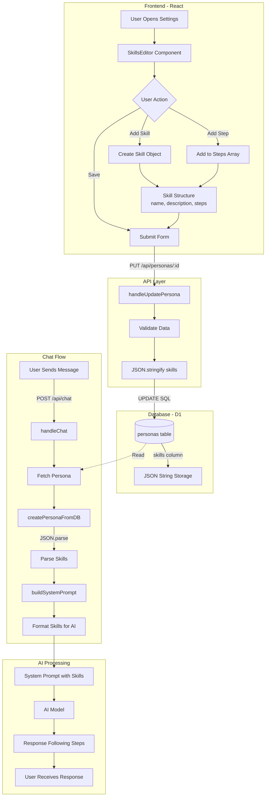
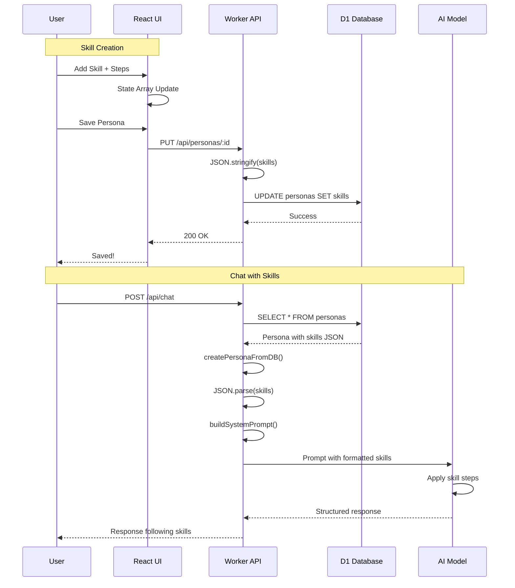

# Skills System Documentation - Complete Technical Guide

## Table of Contents
1. [Overview](#overview)
2. [System Architecture](#system-architecture)
3. [Data Flow Diagrams](#data-flow-diagrams)
4. [Component Details](#component-details)
5. [Database Schema](#database-schema)
6. [UI Implementation](#ui-implementation)
7. [Backend Processing](#backend-processing)
8. [AI Integration](#ai-integration)
9. [Code Examples](#code-examples)
10. [Testing Guide](#testing-guide)

---

## Overview

The Skills System allows users to define structured professional skills for AI personas, which the AI then uses to provide systematic, step-by-step responses. This documentation covers the complete flow from UI input to AI response generation.

### Key Features
- Visual skill builder (no JSON knowledge required)
- Dynamic step management
- Automatic numbering and formatting
- Seamless database persistence
- AI prompt integration

---

## System Architecture

### High-Level Architecture (ASCII)

```
┌─────────────────────────────────────────────────────────────────┐
│                          Frontend (React)                        │
├─────────────────────────────────────────────────────────────────┤
│  Settings.tsx                                                    │
│  ├── SkillsEditor Component                                      │
│  │   ├── Add/Remove Skills                                       │
│  │   ├── Add/Remove Steps                                        │
│  │   └── Real-time Validation                                   │
│  └── Persona Management                                          │
└────────────────────┬────────────────────────────────────────────┘
                     │ HTTP API (JSON)
                     ↓
┌─────────────────────────────────────────────────────────────────┐
│                  Backend (Cloudflare Worker)                     │
├─────────────────────────────────────────────────────────────────┤
│  index.ts                                                        │
│  ├── handleUpdatePersona()                                       │
│  │   └── JSON.stringify(skills)                                  │
│  ├── handleChat()                                                │
│  │   └── createPersonaFromDB()                                   │
│  └── personas.ts                                                 │
│      ├── JSON.parse(skills)                                      │
│      └── buildSystemPrompt()                                     │
└────────────────────┬────────────────────────────────────────────┘
                     │ D1 Database
                     ↓
┌─────────────────────────────────────────────────────────────────┐
│                        D1 Database                               │
├─────────────────────────────────────────────────────────────────┤
│  personas table                                                  │
│  └── skills column (TEXT) - stores JSON string                   │
└─────────────────────────────────────────────────────────────────┘
```

### Mermaid Flow Diagram



---

## Data Flow Diagrams

### Complete Data Flow (ASCII)

```
USER INPUT                     FRONTEND PROCESSING              BACKEND PROCESSING
┌─────────┐                   ┌──────────────────┐            ┌─────────────────┐
│ Add     │                   │ SkillsEditor     │            │ API Endpoint    │
│ Skill   │ ────────────────> │ Component        │ ─────────> │ /api/personas   │
│ Button  │                   │                  │            │                 │
└─────────┘                   └──────────────────┘            └─────────────────┘
     │                                │                               │
     ↓                                ↓                               ↓
┌─────────┐                   ┌──────────────────┐            ┌─────────────────┐
│ Enter   │                   │ State Array:     │            │ JSON.stringify  │
│ Name    │ ────────────────> │ [{               │ ─────────> │ Convert to      │
│ Desc    │                   │   name: "...",   │            │ String          │
│ Steps   │                   │   description:   │            │                 │
└─────────┘                   │   "...",         │            └─────────────────┘
                              │   steps: [...]   │                    │
                              │ }]               │                    ↓
                              └──────────────────┘            ┌─────────────────┐
                                                               │ D1 Database     │
                                                               │ UPDATE personas │
                                                               │ SET skills = ?  │
                                                               └─────────────────┘

CHAT REQUEST                   PERSONA LOADING                AI PROMPT BUILDING
┌─────────┐                   ┌──────────────────┐            ┌─────────────────┐
│ Message │                   │ SELECT * FROM    │            │ createPersona   │
│ from    │ ────────────────> │ personas WHERE   │ ─────────> │ FromDB()        │
│ User    │                   │ id = ?           │            │ JSON.parse      │
└─────────┘                   └──────────────────┘            └─────────────────┘
                                      │                               │
                                      ↓                               ↓
                              ┌──────────────────┐            ┌─────────────────┐
                              │ Raw DB Record    │            │ Persona Object  │
                              │ skills: "JSON"   │ ─────────> │ skills: Array   │
                              └──────────────────┘            └─────────────────┘
                                                                      │
                                                                      ↓
                                                               ┌─────────────────┐
                                                               │ buildSystem     │
                                                               │ Prompt()        │
                                                               │ Format Skills   │
                                                               └─────────────────┘
                                                                      │
                                                                      ↓
                                                               ┌─────────────────┐
                                                               │ AI Receives:    │
                                                               │ ### 1. Skill    │
                                                               │ **Process:**    │
                                                               │ 1. Step one     │
                                                               │ 2. Step two     │
                                                               └─────────────────┘
```

---

## Component Details

### 1. Frontend: SkillsEditor Component (`Settings.tsx`)

**Location:** `/src/components/Settings.tsx`

**Structure:**
```typescript
interface Skill {
  name: string;        // e.g., "Objection Handling"
  description: string; // e.g., "Handle customer concerns"
  steps: string[];     // e.g., ["Listen", "Acknowledge", "Solve"]
}
```

**Key Functions:**
- `addSkill()` - Creates new empty skill
- `removeSkill(index)` - Deletes skill at index
- `updateSkill(index, field, value)` - Updates skill field
- `addStep(skillIndex)` - Adds step to skill
- `removeStep(skillIndex, stepIndex)` - Removes specific step
- `updateStep(skillIndex, stepIndex, value)` - Updates step text

**Visual Layout:**
```
┌──────────────────────────────────────────────┐
│ Professional Skills         [+ Add Skill]    │
├──────────────────────────────────────────────┤
│ ┌────────────────────────────────[🗑️]──────┐ │
│ │ Skill name: [___________________]        │ │
│ │ Description: [___________________]       │ │
│ │              [___________________]       │ │
│ │                                           │ │
│ │ Steps:                    [+ Add Step]   │ │
│ │ 1. [_________________________] [-]       │ │
│ │ 2. [_________________________] [-]       │ │
│ │ 3. [_________________________] [-]       │ │
│ └───────────────────────────────────────────┘ │
└──────────────────────────────────────────────┘
```

### 2. Backend: Persona Update Handler (`index.ts`)

**Location:** `/knowledge-base-api/src/index.ts`

**Function:** `handleUpdatePersona()`
```typescript
async function handleUpdatePersona(id: string, request: Request, env: Env) {
  const personaData = await request.json();
  
  // Critical: Convert skills array to JSON string for storage
  const skillsToStore = typeof personaData.skills === 'string' 
    ? personaData.skills 
    : JSON.stringify(personaData.skills || []);
  
  await env.DB.prepare(`
    UPDATE personas 
    SET skills = ?
    WHERE id = ?
  `).bind(skillsToStore, id).run();
}
```

### 3. Backend: Persona Parser (`personas.ts`)

**Location:** `/knowledge-base-api/src/personas.ts`

**Function:** `createPersonaFromDB()`
```typescript
export function createPersonaFromDB(dbPersona: any): Persona {
  return {
    // ... other fields ...
    skills: dbPersona.skills ? JSON.parse(dbPersona.skills) : [],
    // Converts JSON string back to array of skill objects
  };
}
```

**Function:** `buildSystemPrompt()`
```typescript
export function buildSystemPrompt(persona: Persona): string {
  return `
    ## ⚡ PROFESSIONAL SKILLS & TECHNIQUES
    ${persona.skills.map((skill, index) => `
    ### ${index + 1}. ${skill.name}
    **Description:** ${skill.description}
    **Process:**
    ${skill.steps.map((step, i) => `   ${i + 1}. ${step}`).join('\n')}
    `).join('\n')}
  `;
}
```

---

## Database Schema

### Personas Table Structure

```sql
CREATE TABLE personas (
  id TEXT PRIMARY KEY,
  name TEXT NOT NULL,
  role TEXT NOT NULL,
  experience TEXT,
  primary_goal TEXT,
  communication_style TEXT,
  responsibilities TEXT,      -- JSON string array
  skills TEXT,                -- JSON string array of objects
  constraints TEXT,           -- JSON string array
  expertise_areas TEXT,       -- JSON string array
  personality_traits TEXT,    -- JSON string array
  success_metrics TEXT,       -- JSON string array
  context_awareness TEXT,     -- JSON string array
  is_custom INTEGER DEFAULT 1,
  created_at DATETIME DEFAULT CURRENT_TIMESTAMP,
  timezone TEXT DEFAULT 'America/Los_Angeles',
  business_hours TEXT DEFAULT '9:00 AM - 5:00 PM'
);
```

### Skills Column Data Format

```json
[
  {
    "name": "Objection Handling",
    "description": "Effectively handle customer objections",
    "steps": [
      "Listen actively to the concern",
      "Acknowledge and empathize with the customer",
      "Provide a tailored solution or alternative"
    ]
  },
  {
    "name": "Needs Discovery",
    "description": "Uncover customer's true needs",
    "steps": [
      "Ask open-ended questions",
      "Listen for emotional cues",
      "Summarize understanding",
      "Confirm priorities with customer"
    ]
  }
]
```

---

## UI Implementation

### Add Persona Form

```typescript
// When adding a new persona
const handleAddPersona = async () => {
  const personaToAdd = {
    id: `custom-${Date.now()}`,
    name: newPersona.name,
    role: newPersona.role,
    // ... other fields ...
    skills: JSON.stringify(newSkills) // Convert array to JSON string
  };
  
  await fetch(`${config.apiEndpoint}/personas`, {
    method: 'POST',
    headers: { 'Content-Type': 'application/json' },
    body: JSON.stringify(personaToAdd)
  });
};
```

### Edit Persona Form

```typescript
// When editing an existing persona
const handleEditClick = (persona) => {
  // Parse existing skills from JSON string
  try {
    const skills = typeof persona.skills === 'string' 
      ? JSON.parse(persona.skills) 
      : persona.skills || [];
    setEditingSkills({ [persona.id]: skills });
  } catch (e) {
    setEditingSkills({ [persona.id]: [] });
  }
};

// When saving edits
const handleSavePersona = async (persona) => {
  const personaToSave = {
    ...persona,
    skills: JSON.stringify(editingSkills[persona.id])
  };
  
  await fetch(`${config.apiEndpoint}/personas/${persona.id}`, {
    method: 'PUT',
    body: JSON.stringify(personaToSave)
  });
};
```

---

## Backend Processing

### Complete Chat Flow with Skills

```typescript
// 1. User sends chat message
POST /api/chat
{
  "message": "I'm not ready, you guys are expensive",
  "personaId": "chris-voss-negotiator"
}

// 2. Backend fetches persona from database
const { results } = await env.DB.prepare(
  'SELECT * FROM personas WHERE id = ?'
).bind(personaId).all();

// 3. Parse persona data including skills
const persona = createPersonaFromDB(results[0]);
// skills are now an array of Skill objects

// 4. Build system prompt with formatted skills
const systemPrompt = buildSystemPrompt(persona);

// 5. System prompt sent to AI includes:
"""
## ⚡ PROFESSIONAL SKILLS & TECHNIQUES

### 1. Objection Handling
**Description:** Effectively handle customer objections
**Process:**
   1. Listen actively to the concern
   2. Acknowledge and empathize with the customer
   3. Provide a tailored solution or alternative

### 2. Price Negotiation
**Description:** Navigate price discussions strategically
**Process:**
   1. Understand the value perception
   2. Reframe the conversation around ROI
   3. Offer flexible terms if needed
"""

// 6. AI processes message using skills framework
// AI identifies: "not ready" + "expensive" = Use Skill #1 & #2

// 7. AI generates response following skill steps:
"I hear you - choosing the right partner is a big decision and 
price matters. What specific outcomes would make this investment 
worthwhile for you?"
// ↑ Step 1: Listen/Acknowledge
// ↑ Step 2: Empathize
// ↑ Step 3: Reframe to value
```

---

## AI Integration

### How AI Uses Skills in Response Generation

1. **Pattern Recognition**: AI identifies which skill applies based on message content
2. **Step Following**: AI structures response following the numbered steps
3. **Consistency**: Same situation triggers same skill approach

### Example Skill Application

**User Message:** "I'm not convinced this will work for my business"

**AI Processing:**
```
1. Identify concern: Doubt/Skepticism
2. Match to skill: "Objection Handling"
3. Apply steps:
   - Step 1: Listen → "I understand your concern about fit"
   - Step 2: Acknowledge → "It's important to be sure"
   - Step 3: Solution → "Let me show you similar businesses..."
```

**Generated Response:**
"I understand your concern about fit - it's important to be sure. 
Let me show you how similar businesses in your industry achieved 
a 40% increase in efficiency with our solution."

---

## Code Examples

### Example 1: Adding a New Skill in UI

```javascript
// User clicks "Add Skill" button
const addSkill = () => {
  setNewSkills([
    ...newSkills,
    {
      name: '',
      description: '',
      steps: ['']  // Start with one empty step
    }
  ]);
};
```

### Example 2: Database Storage

```sql
-- Actual SQL executed when saving
UPDATE personas 
SET skills = '[{"name":"Objection Handling","description":"Handle concerns","steps":["Listen","Acknowledge","Solve"]}]'
WHERE id = 'chris-voss-negotiator';
```

### Example 3: AI Prompt Generation

```typescript
// From personas.ts - buildSystemPrompt()
const formattedSkills = persona.skills.map((skill, index) => `
### ${index + 1}. ${skill.name}
**Description:** ${skill.description}
**Process:**
${skill.steps.map((step, i) => `   ${i + 1}. ${step}`).join('\n')}
`).join('\n');
```

---

## Testing Guide

### 1. Test Skill Creation

```bash
# Frontend test
1. Navigate to Settings → Personas
2. Click "Add Persona" or edit existing
3. Click "Add Skill"
4. Enter:
   - Name: "Test Skill"
   - Description: "Testing the system"
   - Steps: ["First step", "Second step"]
5. Save persona
```

### 2. Verify Database Storage

```bash
# Check database via Wrangler CLI
npx wrangler d1 execute knowledge-base-db --local \
  --command "SELECT id, name, skills FROM personas WHERE id='test-persona';"

# Expected output:
# skills column should contain JSON string
```

### 3. Test Chat Integration

```bash
# Send test message
curl -X POST https://your-api.workers.dev/api/chat \
  -H "Content-Type: application/json" \
  -d '{
    "message": "I have a concern about implementation",
    "personaId": "test-persona"
  }'

# Response should follow skill steps structure
```

### 4. Debugging Checklist

- [ ] Skills saved as JSON string in database?
- [ ] Skills parsed correctly in createPersonaFromDB?
- [ ] Skills formatted properly in buildSystemPrompt?
- [ ] AI response follows skill steps?

---

## Common Issues & Solutions

### Issue 1: Skills Not Saving

**Symptom:** Skills disappear after save
**Solution:** Check JSON.stringify in handleUpdatePersona

```javascript
// Correct
skills: JSON.stringify(personaData.skills || [])

// Incorrect
skills: personaData.skills  // Might save [object Object]
```

### Issue 2: Skills Not Loading

**Symptom:** Edit form shows empty skills
**Solution:** Check JSON.parse in edit handler

```javascript
// Correct parsing with error handling
try {
  const skills = typeof persona.skills === 'string' 
    ? JSON.parse(persona.skills) 
    : persona.skills || [];
} catch (e) {
  console.error('Failed to parse skills:', e);
  const skills = [];
}
```

### Issue 3: AI Not Using Skills

**Symptom:** AI responses don't follow skill structure
**Solution:** Verify buildSystemPrompt formatting

```typescript
// Check system prompt includes:
console.log(systemPrompt);
// Should show formatted skills with ### headers and numbered steps
```

---

## Appendix: Complete Flow Summary



---

## Conclusion

The Skills System provides a complete solution for defining and using structured professional skills in AI personas. The visual UI eliminates the need for JSON knowledge, while the backend ensures proper data persistence and AI integration. The system follows a clear data flow from user input through database storage to AI response generation, with each skill's numbered steps providing consistent, professional responses.

For questions or issues, refer to the debugging checklist or contact the development team.

---

**Last Updated:** 2025-08-16
**Version:** 1.0.0
**Author:** Development Team